* [github repository](https://github.com/good5dog5/raytracing)  
* [課程網頁](http://wiki.csie.ncku.edu.tw/embedded/2016q1h2)

## 作業(A)  


### 目標
>* 以 `make PROFILE=1` 重新編譯程式碼，並且學習 [gprof](https://sourceware.org/binutils/docs/gprof/)  
>* 以 `gprof` 指出效能瓶頸，並且著手改寫檔案 `math-toolkit.h` 在內的函式實做，充分紀錄效能差異在共筆  
>* 注意: 請勿更動編譯器最佳化選項 `-O0` (關閉最佳化)  
>* 檔案 math-toolkit.h 定義的若干數學操作函式很重要，可參考 [SIMD optimized dot and cross product functions](http://tomjbward.co.uk/simd-optimized-dot-and-cross/) 和 [2015q3 Homework #1 Ext](http://wiki.csie.ncku.edu.tw/embedded/2015q3h1ext)  
>將你的觀察、分析，以及各式效能改善過程，並善用 `gnuplot` 製圖。

<!--more-->


### gprof - Gun Profiler

---

Profiling能讓程式撰寫者了解程式花在各function的時間和function間的呼叫關係，並能有效找出與預期有落差的funciton，
改善整體效能。

gprof需要在compile時加入 `-pg` flag，如此會告知 `gcc` 在compile時為每個function加入名為mcount ( or  “_mcount”  , or  “__mcount” , depend on compiler and OS.)的函数
則每個funciton執行時都會call mcount，而mcount會存有一份calling graph，裡頭紀錄了child function和parent funciton的關係，呼叫時間以及呼叫次數等資訊。

利用`make PROFILE=1`編譯時：

~~~ sh
ifeq ($(strip $(PROFILE)),1)
PROF_FLAGS = -pg
CFLAGS += $(PROF_FLAGS)
LDFLAGS += $(PROF_FLAGS) 
endif
~~~

`$(strip $(PROFILE)), 1)`，strip去掉$PROFILE的開頭結尾空字符
比較$PROFILE==1?，成立時則將`CFLAGS`和 `LDFLAGS` 加入 `-pg`字串
因為在runtime會多執行mcount，故執行時間會比沒有加`-pg`flag的慢許多。

~~~ bash
make PROFILE=1
~~~
執行 ./raytracing，得到gmon.out(只能用gprof來讀取)，並把data 
redirect到`analysis.txt`

~~~ sh
gprof raytracing gmon.out > analysis.txt  
~~~

### 利用 [Graphviz](http://www.graphviz.org/) 產生函數呼叫關係圖

---

> Graphviz is open source graph visualization software. Graph visualization is a  way of
> representing structural information as diagrams of abstract graphs and  networks. It has important
> applications in networking, bioinformatics,  software  engineering, database and web design,
> machine learning, and in visual interfaces  for other technical domains.

參考[林秉錚的hackpad](https://embedded2016.hackpad.com/2016q1-Homwork2a--QixiAsqbVaf)

~~~ sh
#安裝
pip install gprof2dot
~~~

1.  利用[gprof2dot](https://github.com/jrfonseca/gprof2dot)，將`gmon.out`轉成`graphviz` 所用的`dot language`

``` sh
gprof raytracing | gprof2dot
```

結果

``` dot
digraph {
	graph [fontname=Arial, nodesep=0.125, ranksep=0.25];
	node [fontcolor=white, fontname=Arial, height=0, shape=box, style=filled, width=0];
	edge [fontname=Arial];
	1 [color="#ff0000", fontcolor="#ffffff", fontsize="10.00", label="raytracing\n100.00%\n(0.59%)\n1×"];
	1 -> 3 [arrowsize="0.97", color="#f63d01", fontcolor="#f63d01", fontsize="10.00", label="93.96%\n1048576×", labeldistance="3.76", penwidth="3.76"];
	1 -> 15 [arrowsize="0.35", color="#0d2379", fontcolor="#0d2379", fontsize="10.00", label="5.15%\n1048576×", labeldistance="0.50", penwidth="0.50"];
	2 [color="#ff0000", fontcolor="#ffffff", fontsize="10.00", label="main\n100.00%\n(0.00%)"];
	2 -> 1 [arrowsize="1.00", color="#ff0000", fontcolor="#ff0000", fontsize="10.00", label="100.00%\n1×", labeldistance="4.00", penwidth="4.00"];
	3 [color="#f63d01", fontcolor="#ffffff", fontsize="10.00", label="ray_color\n93.96%\n(1.48%)\n2403255×"];
	3 -> 3 [arrowsize="0.97", color="#f63d01", fontcolor="#f63d01", fontsize="10.00", label="1354679×", labeldistance="3.76", penwidth="3.76"];
	3 -> 4 [arrowsize="0.70", color="#0ab50f", fontcolor="#0ab50f", fontsize="10.00", label="49.29%\n4620625×", labeldistance="1.97", penwidth="1.97"];
	3 -> 6 [arrowsize="0.42", color="#0c6389", fontcolor="#0c6389", fontsize="10.00", label="17.35%\n2110576×", labeldistance="0.69", penwidth="0.69"];
	3 -> 7 [arrowsize="0.35", color="#0d1e78", fontcolor="#0d1e78", fontsize="10.00", label="4.00%\n2596277×", labeldistance="0.50", penwidth="0.50"];
	3 -> 9 [arrowsize="0.35", color="#0d0f73", fontcolor="#0d0f73", fontsize="10.00", label="0.51%\n686738×", labeldistance="0.50", penwidth="0.50"];
	3 -> 11 [arrowsize="0.35", color="#0d3c80", fontcolor="#0d3c80", fontsize="10.00", label="10.22%\n2110576×", labeldistance="0.50", penwidth="0.50"];
	3 -> 12 [arrowsize="0.35", color="#0d0e73", fontcolor="#0d0e73", fontsize="10.00", label="0.40%\n2483196×", labeldistance="0.50", penwidth="0.50"];
	3 -> 13 [arrowsize="0.35", color="#0d1074", fontcolor="#0d1074", fontsize="10.00", label="0.72%\n3169934×", labeldistance="0.50", penwidth="0.50"];
	3 -> 16 [arrowsize="0.35", color="#0d2279", fontcolor="#0d2279", fontsize="10.00", label="4.90%\n3724794×", labeldistance="0.50", penwidth="0.50"];
	3 -> 17 [arrowsize="0.35", color="#0d1375", fontcolor="#0d1375", fontsize="10.00", label="1.40%\n1241598×", labeldistance="0.50", penwidth="0.50"];
	3 -> 19 [arrowsize="0.35", color="#0d1375", fontcolor="#0d1375", fontsize="10.00", label="1.48%\n2520791×", labeldistance="0.50", penwidth="0.50"];
	3 -> 20 [arrowsize="0.35", color="#0d1074", fontcolor="#0d1074", fontsize="10.00", label="0.85%\n1241598×", labeldistance="0.50", penwidth="0.50"];
	3 -> 21 [arrowsize="0.35", color="#0d1074", fontcolor="#0d1074", fontsize="10.00", label="0.89%\n1204003×", labeldistance="0.50", penwidth="0.50"];
	4 [color="#0ab50f", fontcolor="#ffffff", fontsize="10.00", label="ray_hit_object\n49.29%\n(2.67%)\n4620625×"];
	4 -> 5 [arrowsize="0.52", color="#0c9789", fontcolor="#0c9789", fontsize="10.00", label="27.38%\n13861875×", labeldistance="1.10", penwidth="1.10"];
	4 -> 8 [arrowsize="0.38", color="#0c5486", fontcolor="#0c5486", fontsize="10.00", label="14.73%\n13861875×", labeldistance="0.59", penwidth="0.59"];
	4 -> 9 [arrowsize="0.35", color="#0d1b77", fontcolor="#0d1b77", fontsize="10.00", label="3.46%\n4620625×", labeldistance="0.50", penwidth="0.50"];
	4 -> 13 [arrowsize="0.35", color="#0d1174", fontcolor="#0d1174", fontsize="10.00", label="1.05%\n4620625×", labeldistance="0.50", penwidth="0.50"];
	5 [color="#0c9789", fontcolor="#ffffff", fontsize="10.00", label="rayRectangularIntersection\n27.38%\n(10.09%)\n13861875×"];
	5 -> 9 [arrowsize="0.35", color="#0d1074", fontcolor="#0d1074", fontsize="10.00", label="0.89%\n1187811×", labeldistance="0.50", penwidth="0.50"];
	5 -> 10 [arrowsize="0.35", color="#0d1f78", fontcolor="#0d1f78", fontsize="10.00", label="4.27%\n28627374×", labeldistance="0.50", penwidth="0.50"];
	5 -> 12 [arrowsize="0.35", color="#0d277a", fontcolor="#0d277a", fontsize="10.00", label="5.93%\n36717187×", labeldistance="0.50", penwidth="0.50"];
	5 -> 13 [arrowsize="0.35", color="#0d0e73", fontcolor="#0d0e73", fontsize="10.00", label="0.27%\n1187811×", labeldistance="0.50", penwidth="0.50"];
	5 -> 14 [arrowsize="0.35", color="#0d277a", fontcolor="#0d277a", fontsize="10.00", label="5.93%\n17821807×", labeldistance="0.50", penwidth="0.50"];
	6 [color="#0c6389", fontcolor="#ffffff", fontsize="10.00", label="compute_specular_diffuse\n17.35%\n(3.86%)\n2110576×"];
	6 -> 7 [arrowsize="0.35", color="#0d397f", fontcolor="#0d397f", fontsize="10.00", label="9.75%\n6331728×", labeldistance="0.50", penwidth="0.50"];
	6 -> 10 [arrowsize="0.35", color="#0d1375", fontcolor="#0d1375", fontsize="10.00", label="1.49%\n9964085×", labeldistance="0.50", penwidth="0.50"];
	6 -> 12 [arrowsize="0.35", color="#0d0e73", fontcolor="#0d0e73", fontsize="10.00", label="0.34%\n2110576×", labeldistance="0.50", penwidth="0.50"];
	6 -> 13 [arrowsize="0.35", color="#0d1575", fontcolor="#0d1575", fontsize="10.00", label="1.91%\n8442304×", labeldistance="0.50", penwidth="0.50"];
	7 [color="#0c5d88", fontcolor="#ffffff", fontsize="10.00", label="normalize\n16.32%\n(16.32%)\n10598450×"];
	8 [color="#0c5486", fontcolor="#ffffff", fontsize="10.00", label="raySphereIntersection\n14.73%\n(6.53%)\n13861875×"];
	8 -> 7 [arrowsize="0.35", color="#0d1174", fontcolor="#0d1174", fontsize="10.00", label="0.96%\n621866×", labeldistance="0.50", penwidth="0.50"];
	8 -> 9 [arrowsize="0.35", color="#0d0f73", fontcolor="#0d0f73", fontsize="10.00", label="0.47%\n621866×", labeldistance="0.50", penwidth="0.50"];
	8 -> 10 [arrowsize="0.35", color="#0d1f78", fontcolor="#0d1f78", fontsize="10.00", label="4.23%\n28345616×", labeldistance="0.50", penwidth="0.50"];
	8 -> 12 [arrowsize="0.35", color="#0d1776", fontcolor="#0d1776", fontsize="10.00", label="2.34%\n14483741×", labeldistance="0.50", penwidth="0.50"];
	8 -> 13 [arrowsize="0.35", color="#0d0e73", fontcolor="#0d0e73", fontsize="10.00", label="0.21%\n933714×", labeldistance="0.50", penwidth="0.50"];
	9 [color="#0d4c84", fontcolor="#ffffff", fontsize="10.00", label="add_vector\n13.35%\n(13.35%)\n17836094×"];
	10 [color="#0d3d80", fontcolor="#ffffff", fontsize="10.00", label="dot_product\n10.39%\n(10.39%)\n69646433×"];
	11 [color="#0d3c80", fontcolor="#ffffff", fontsize="10.00", label="localColor\n10.22%\n(2.37%)\n2110576×"];
	11 -> 9 [arrowsize="0.35", color="#0d2179", fontcolor="#0d2179", fontsize="10.00", label="4.74%\n6331728×", labeldistance="0.50", penwidth="0.50"];
	11 -> 13 [arrowsize="0.35", color="#0d1575", fontcolor="#0d1575", fontsize="10.00", label="1.91%\n8442304×", labeldistance="0.50", penwidth="0.50"];
	11 -> 18 [arrowsize="0.35", color="#0d1274", fontcolor="#0d1274", fontsize="10.00", label="1.19%\n4221152×", labeldistance="0.50", penwidth="0.50"];
	12 [color="#0d377f", fontcolor="#ffffff", fontsize="10.00", label="subtract_vector\n9.20%\n(9.20%)\n56956357×"];
	13 [color="#0d2c7c", fontcolor="#ffffff", fontsize="10.00", label="multiply_vector\n7.12%\n(7.12%)\n31410180×"];
	14 [color="#0d277a", fontcolor="#ffffff", fontsize="10.00", label="cross_product\n5.93%\n(5.93%)\n17821809×"];
	15 [color="#0d2379", fontcolor="#ffffff", fontsize="10.00", label="rayConstruction\n5.15%\n(0.30%)\n1048576×"];
	15 -> 7 [arrowsize="0.35", color="#0d1375", fontcolor="#0d1375", fontsize="10.00", label="1.61%\n1048576×", labeldistance="0.50", penwidth="0.50"];
	15 -> 9 [arrowsize="0.35", color="#0d1776", fontcolor="#0d1776", fontsize="10.00", label="2.36%\n3145728×", labeldistance="0.50", penwidth="0.50"];
	15 -> 12 [arrowsize="0.35", color="#0d0d73", fontcolor="#0d0d73", fontsize="10.00", label="0.17%\n1048576×", labeldistance="0.50", penwidth="0.50"];
	15 -> 13 [arrowsize="0.35", color="#0d1074", fontcolor="#0d1074", fontsize="10.00", label="0.71%\n3145728×", labeldistance="0.50", penwidth="0.50"];
	16 [color="#0d2379", fontcolor="#ffffff", fontsize="10.00", label="length\n5.04%\n(5.04%)\n3838091×"];
	17 [color="#0d1375", fontcolor="#ffffff", fontsize="10.00", label="reflection\n1.40%\n(0.00%)\n1241598×"];
	17 -> 9 [arrowsize="0.35", color="#0d1174", fontcolor="#0d1174", fontsize="10.00", label="0.93%\n1241598×", labeldistance="0.50", penwidth="0.50"];
	17 -> 10 [arrowsize="0.35", color="#0d0e73", fontcolor="#0d0e73", fontsize="10.00", label="0.19%\n1241598×", labeldistance="0.50", penwidth="0.50"];
	17 -> 13 [arrowsize="0.35", color="#0d0e73", fontcolor="#0d0e73", fontsize="10.00", label="0.28%\n1241598×", labeldistance="0.50", penwidth="0.50"];
	18 [color="#0d1274", fontcolor="#ffffff", fontsize="10.00", label="multiply_vectors\n1.19%\n(1.19%)\n4221152×"];
	19 [color="#0d1375", fontcolor="#ffffff", fontsize="10.00", label="idx_stack_top\n1.48%\n(1.19%)\n2520791×"];
	20 [color="#0d1074", fontcolor="#ffffff", fontsize="10.00", label="refraction\n0.85%\n(0.59%)\n1241598×"];
	20 -> 10 [arrowsize="0.35", color="#0d0e73", fontcolor="#0d0e73", fontsize="10.00", label="0.19%\n1241598×", labeldistance="0.50", penwidth="0.50"];
	21 [color="#0d1074", fontcolor="#ffffff", fontsize="10.00", label="idx_stack_push\n0.89%\n(0.89%)\n1204003×"];
}
```



2.直接轉成圖片

``` sh
gprof raytracing | gprof2dot | dot -Tpng -o codemap.png
```


`analysis.txt` 中分為幾個部份

1. [Flat Profile](https://sourceware.org/binutils/docs/gprof/Flat-Profile.html)  
**The flat profile shows the total amount of time your program spent executing each function.**


各column分別代表

* `time`  
    function執行時間的百分比，加總起來應為100%。
* `cumulative seconds`  
    此function的執行時間(second)，加上此funciton之前functions執行時間的總和。
* `self seconds`  
    此function獨自執行的時間，flat profile以此column為第一順位排序。
* `calls`
    此function被called的次數，如果被called的次數沒辦法被統計或
    This is the total number of times the function was called. If the function was never called, or the number of times it was called cannot be determined (probably because the function was not compiled with profiling enabled), the calls field is blank.
* `self ms/call`  
    代表 **average number of milliseconds spent in this function per call**， 若沒被profiled則為空。
* `total ms/call`  
    This represents the average number of milliseconds spent in this function and its descendants per call, if this function is profiled. Otherwise, this field is blank for this function. This is the only field in the flat profile that uses call graph analysis.
* `name`  
    funtion name.

由flat profile中可發現，主要的效能瓶頸在  


| function name   | calls    | second |
|-----------------|:--------:|-------:|
| dot_product     | 69646433 | 1.19   |
| subtract_vector | 56956357 | 0.58   |
| multiply_vector | 31410180 | 0.34   |


## 修改 math-toolkit.h

可以發現 `add_vector`, `subtract_vector`, `multiply_vectors`, `multiply_vector`,
`dot_product`中的forloop都只有3個iteration，因為本作業強制使用`-O0`
flag（禁用最佳化），所以編譯器不會幫忙做[loop unrolling](https://www.wikiwand.com/en/Loop_unrolling)。

* loop unrolling的好處
    1. 減少index arthimetic operation，和end of loop test。
    2. 最小化branch penalty。
    3. 能讓instruction更能平行執行。

* loop unrolling的壞處
    1. code size變大。

~~~ c

static inline
void add_vector(const double *a, const double *b, double *out)
{
    for (int i = 0; i < 3; i++)
        out[i] = a[i] + b[i];
}

static inline
void subtract_vector(const double *a, const double *b, double *out)
{
    for (int i = 0; i < 3; i++)
        out[i] = a[i] - b[i];
}

static inline
void multiply_vectors(const double *a, const double *b, double *out)
{
    for (int i = 0; i < 3; i++)
        out[i] = a[i] * b[i];
}

static inline
void multiply_vector(const double *a, double b, double *out)
{
    for (int i = 0; i < 3; i++)
        out[i] = a[i] * b;
}

static inline
double dot_product(const double *v1, const double *v2)
{
    double dp = 0.0;
    for (int i = 0; i < 3; i++)
        dp += v1[i] * v2[i];
    return dp;
}
~~~

做完 loop unrolling後

~~~ c

static inline
void add_vector(const double *a, const double *b, double *out)
{
        out[0] = a[0] + b[0];
        out[1] = a[1] + b[1];
        out[2] = a[2] + b[2];
}

static inline
void subtract_vector(const double *a, const double *b, double *out)
{
        out[0] = a[0] - b[0];
        out[1] = a[1] - b[1];
        out[2] = a[2] - b[2];
}

static inline
void multiply_vectors(const double *a, const double *b, double *out)
{
        out[0] = a[0] * b[0];
        out[1] = a[1] * b[1];
        out[2] = a[2] * b[2];
}

static inline
void multiply_vector(const double *a, double b, double *out)
{
        out[0] = a[0] * b;
        out[1] = a[1] * b;
        out[2] = a[2] * b;
}

static inline
void cross_product(const double *v1, const double *v2, double *out)
{
    out[0] = v1[1] * v2[2] - v1[2] * v2[1];
    out[1] = v1[2] * v2[0] - v1[0] * v2[2];
    out[2] = v1[0] * v2[1] - v1[1] * v2[0];
}

static inline
double dot_product(const double *v1, const double *v2)
{
    double dp = 0.0;
    dp += v1[0] * v2[0];
    dp += v1[1] * v2[1];
    dp += v1[2] * v2[2];
    return dp;
}
~~~

整體執行時間快了`1.1 second`


### 利用inline

參考[課程提示](https://embedded2016.hackpad.com/ep/pad/static/xBRCF9BsC50)

根據[GCC manual](https://gcc.gnu.org/onlinedocs/gcc/Inline.html)

> GCC does not inline any functions when not optimizing unless you specify the ‘always_inline’
> attribute for the function, like this: 
> / Prototype. 
> inline void foo (const char) attribute((always_inline));

> The remainder of this section is specific to GNU C90 inlining.

因為關閉最佳化，所以function宣告為inline並不會有作用，但為了測試inline
對效能的影響，在Makefile中的`CFLAGS`加上 ` -D__forceinline="__attribute__((always_inline))"`
並把原本須告為static inline的functions後接加上 `__forceinline`

~~~ c
static inline __forceinline
void normalize(double *v)

static inline __forceinline
double length(const double *v)

static inline __forceinline
void add_vector(const double *a, const double *b, double *out)

static inline __forceinline
void subtract_vector(const double *a, const double *b, double *out)

static inline __forceinline
void multiply_vectors(const double *a, const double *b, double *out)

static inline __forceinline
void multiply_vector(const double *a, double b, double *out)

static inline __forceinline
void cross_product(const double *v1, const double *v2, double *out)

static inline __forceinline
double dot_product(const double *v1, const double *v2)

static inline __forceinline
void scalar_triple_product(const double *u, const double *v, const double *w, double *out)

static inline __forceinline
double scalar_triple(const double *u, const double *v, const double *w)
~~~

GCC:
> By declaring a function inline, you can direct GCC to make calls to that function faster. One way
> GCC can achieve this is to integrate that function's code into the code for its callers. This
> makes execution faster by eliminating the function-call overhead; in addition, if any of the
> actual argument values are constant, their known values may permit simplifications at compile time
> so that not all of the inline function's code needs to be included. The effect on code size is
> less predictable; object code may be larger or smaller with function inlining, depending on the
> particular case.

force inline + loop unrolling效能比較圖,可以看到比原本快了`3.9 second`


### 利用SIMD

---


SIMD是**Single Instruction/Multiple Data**的縮寫，相較於原本每個指令只處理單一data(SISD or Scalar operation)，SIMD能夠在單一指令中處理多個data。


但SIMD只能處理特定的**predefined processing pattern**，例如以下情況是SIMD無法處理的。


根據[Intel intrinstic guide](https://software.intel.com/sites/landingpage/IntrinsicsGuide/#)列出的intrinstic instruction中屬於SIMD指令集的有


查看 `/proc/cpuinfo`，發現本機cpu為`i5-3320M` 支援`sse4.1` `sse4.2`, `avx`等SIMD指令集架構，因`avx`是基於sse的延伸，且具有**256 bit register**，故用`avx`來作SIMD加速。


#### AVX , YMM  and XMM

XMM是舊有SEE指令集的暫存器，只有128 bits，AVX中則有16個256 bits AVX暫存器，和一個control/status register, MXCSR。


#### 修改add_vector to SIMD

~~~ c
static inline  void add_vector(const double *a, const double *b, double *out) __forceinline
{
    //SIMD version
    __m256d v1     = _mm256_set_pd(a[0], a[1], a[2], 0.0);
    __m256d v2     = _mm256_set_pd(b[0], b[1], b[2], 0.0);
    __m256d result = _mm256_add_pd(v1, v2);

    double tmp[4];
    _mm256_store_pd(tmp, result);

    out[0] = tmp[3];
    out[1] = tmp[2];
    out[2] = tmp[1];
    
    // Original
    // out[0] = a[0] + b[0];
    // out[1] = a[1] + b[1];
    // out[2] = a[2] + b[2];
}
~~~

可以看到時間不降反升，從`0.10` -> `0.54`

## Reference

SIMD
[evanjack2002 / 開發紀錄(A)](https://embedded2016.hackpad.com/2016-Homework-2-A-Od4A8UUBgpF#:h=gprof,-perf,-graphviz-and-gpro)
[FastC++: Coding Cpp Efficiently](http://fastcpp.blogspot.tw/2011/04/vector-cross-product-using-sse-code.html)
[Introduction to Intel® Advanced Vector Extensions](https://software.intel.com/en-us/articles/introduction-to-intel-advanced-vector-extensions)
[Basic of SIMD Programming](https://www.kernel.org/pub/linux/kernel/people/geoff/cell/ps3-linux-docs/CellProgrammingTutorial/BasicsOfSIMDProgramming.html)
[Wiki about SSE/AVX](https://www.wikiwand.com/zh-tw/SSE)
